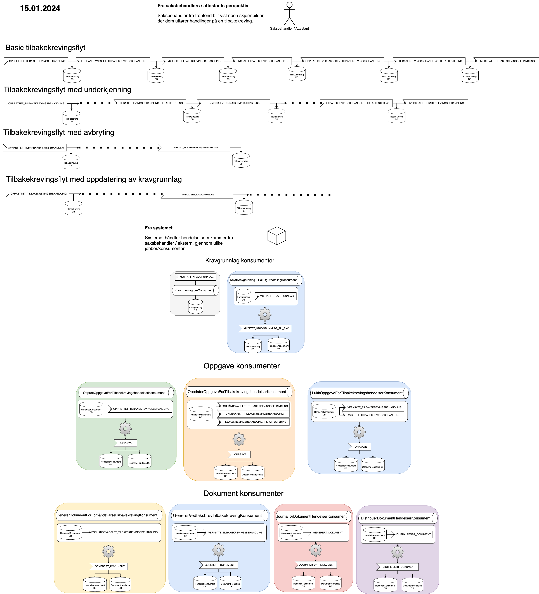

# Tilbakekrevingskomponenten

### Innhold kommer

#### Flytdiagram

* Ved ønske å endre diagrammet, kan du åpne .png filen i draw.io og endre i vei - Endringene kan lagres automatisk, ellers kan du lagre nytt bilde som .png og ersatte det som allerede er her